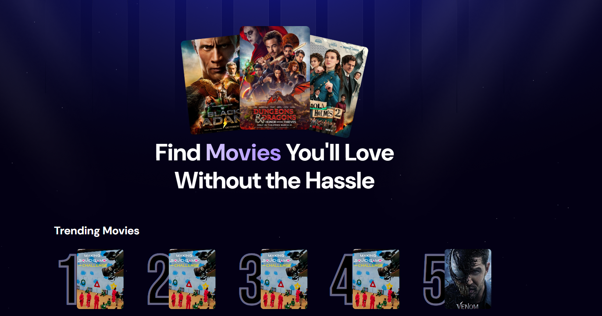

<div align="center">
  <a href="https://cm-movie-app.netlify.app/" target="_blanck"></a>
   <div align="center">
     
     
     
     
   </div>
  <h3 align="center">Movie App</h3>
</div>

## <br /> 📋 <a name="table">Summary</a>

- ✨ [Introduction](#introduction)
- 🛠 [Technology Used](#tech-stack)
- 📝 [Features](#features)
- 🚀 [Launch App](#launch-app)
- 🎨 [Styling](#style)

## <br /> <a name="introduction">✨ Introduction</a>

**[ENG]** Movie App is a modern web application that lets users easily search for movies and view detailed information for each title. Built with React, TailwindCSS, and Appwrite, it offers a fast and responsive user experience. Key features include optimized search with input debouncing, detailed movie pages, and smooth navigation with React Router.

**[FR]** Movie App est une application web moderne qui permet aux utilisateurs de rechercher facilement des films et d’accéder à leurs détails. Développée avec React, TailwindCSS et Appwrite, elle offre une expérience fluide et rapide. Les fonctionnalités clés incluent une recherche optimisée avec debounce, des pages film détaillées, et une navigation fluide grâce à React Router.

## <br /> <a name="tech-stack">🛠 Technology Used</a>

- [TailwindCSS](https://tailwindcss.com/docs/installation)
Tailwind CSS is a valuable tool for developers who want to build modern, responsive, and visually appealing websites without sacrificing development speed.

- [react-router-dom](https://www.npmjs.com/package/react-router-dom)
The react-router-dom package contains bindings for using React Router in web applications. Please see the Getting Started guide for more information on how to get started with React Router.

- [Appwrite](https://appwrite.io/)
Appwrite is an open-source backend-as-a-service (BaaS) platform that simplifies the development of web and mobile applications by providing a set of ready-to-use APIs and services.

- [react-debounce](https://www.npmjs.com/package/react-debounce)
The react-debounce package provides a simple way to debounce user input in React applications, allowing developers to control the frequency of function calls triggered by user interactions, such as typing in a search input.


## <a name="features">📝 Features</a>

👉 **Modern User Interface**: A modern and user-friendly interface, offering an intuitive experience for users.

👉 **Search Functionality**: Users can search for movies by title making it easy to find specific films.

👉 **Optimized Search**: Debounces user input to reduce unnecessary API calls, ensuring faster performance and a smoother user experience.

👉 **Movie Details**: Each movie has a dedicated page with detailed information, including cast, crew, and reviews.

👉 **Responsive Design**: The app is designed to be fully responsive, ensuring a seamless experience on both desktop and mobile devices.


## <br /> <a name="launch-app">🚀 Launch App</a>

Follow these steps to set up the project locally on your machine.

**Prerequisites**

>[!NOTE]
> Make sure you have the following installed on your machine:

- [Git](https://git-scm.com/)
- [Node.js](https://nodejs.org/en)
- [npm](https://www.npmjs.com/) *(Node Package Manager)*

**Cloning the Repository**

```bash
git clone {git remote URL}
cd {git project..}
```

**Installation**

> After cloning the repository, run the command `npm i` or `yarn i` to install the project's dependencies.

> Run the development server:

```bash
npm run dev
# or
yarn dev
# or
pnpm dev
# or
bun dev
```
## <br /> <a name="style">🎨 Styling</a>

Global styling are defined using **CSS** & **TailwindCSS**

<details>
<summary><code>index.css</code></summary>

```css
@import url("https://fonts.googleapis.com/css2?family=DM+Sans:ital,opsz,wght@0,9..40,100..1000;1,9..40,100..1000&display=swap");
@import url("https://fonts.googleapis.com/css2?family=Bebas+Neue&display=swap");

@import "tailwindcss";

@theme {
  --color-primary: #030014;

  --color-light-100: #cecefb;
  --color-light-200: #a8b5db;

  --color-gray-100: #9ca4ab;

  --color-dark-100: #0f0d23;

  --color-blue-100: #221F3D;

  --font-dm-sans: DM Sans, sans-serif;

  --breakpoint-xs: 480px;

  --background-image-hero-pattern: url("/hero-bg.png");
}

@layer base {
  body {
    font-family: "DM Sans", serif;
    font-optical-sizing: auto;
    background: #030014;
  }

  h1 {
    @apply mx-auto max-w-4xl text-center text-5xl font-bold leading-tight tracking-[-1%] text-white sm:text-[64px] sm:leading-[76px];
  }

  h2 {
    @apply text-2xl font-bold text-white sm:text-3xl;
  }

  main {
    @apply min-h-screen relative bg-primary;
  }

  header {
    @apply sm:mt-10 mt-5;
  }

  header img {
    @apply w-full max-w-lg h-auto object-contain mx-auto drop-shadow-md;
  }
}

@layer components {
  .pattern {
    @apply bg-hero-pattern w-full h-screen bg-center bg-cover absolute z-0;
  }

  .wrapper {
    @apply px-5 py-12 xs:p-10 max-w-7xl mx-auto flex flex-col relative z-10;
  }

  .trending {
    @apply mt-20;

    & ul {
      @apply flex flex-row overflow-y-auto gap-5 -mt-10 w-full hide-scrollbar;
    }

    & ul li {
      @apply min-w-[230px] flex flex-row items-center;
    }

    & ul li p {
      @apply fancy-text mt-[22px] text-nowrap;
    }

    & ul li img {
      @apply w-[127px] h-[163px] rounded-lg object-cover -ml-3.5;
    }
  }

  .search {
    @apply w-full bg-light-100/5 px-4 py-3 rounded-lg mt-10 max-w-3xl mx-auto;

    & div {
      @apply relative flex items-center;
    }

    & img {
      @apply absolute left-2 h-5 w-5;
    }

    & input {
      @apply w-full bg-transparent py-2 sm:pr-10 pl-10 text-base text-gray-200 placeholder-light-200 outline-hidden;
    }
  }

  .all-movies {
    @apply space-y-9;

    & ul {
      @apply grid grid-cols-1 gap-5 xs:grid-cols-2 md:grid-cols-3 lg:grid-cols-4;
    }
  }

  .movie-card {
    @apply bg-dark-100 p-5 rounded-2xl shadow-inner shadow-light-100/10;

    & img {
      @apply rounded-lg h-auto w-full;
    }

    & h3 {
      @apply text-white font-bold text-base line-clamp-1;
    }

    & .content {
      @apply mt-2 flex flex-row items-center flex-wrap gap-2;
    }

    & .rating {
      @apply flex flex-row items-center gap-1;
    }

    & .rating img {
      @apply size-4 object-contain;
    }

    & .rating p {
      @apply font-bold text-base text-white;
    }

    & .content span {
      @apply text-sm text-gray-100;
    }

    & .content .lang {
      @apply capitalize text-gray-100 font-medium text-base;
    }

    & .content .year {
      @apply text-gray-100 font-medium text-base;
    }
  }

  .movie-header {
    & img {
      @apply w-auto
    }
    & span {
      @apply text-sm text-light-200;
    }
    & p {
      @apply text-lg text-light-200 ;
    }
  }

  .movie-list {    
    & .data-info {
      @apply font-semibold text-light-200
    }
  }
  .dot {
    @apply mx-1 md:inline-block
  }

}

@utility text-gradient {
  @apply bg-linear-to-r from-[#D6C7FF] to-[#AB8BFF] bg-clip-text text-transparent;
}

@utility button-gradient {
  @apply bg-linear-to-r from-[#D6C7FF] to-[#AB8BFF] p-3 rounded-lg font-bold
}

@utility fancy-text {
  -webkit-text-stroke: 5px rgba(206, 206, 251, 0.5);
  font-size: 190px;
  font-family: "Bebas Neue", sans-serif;
}

@utility hide-scrollbar {
  -ms-overflow-style: none;
  scrollbar-width: none;

  &::-webkit-scrollbar {
    display: none;
  }
}

```
</details>
